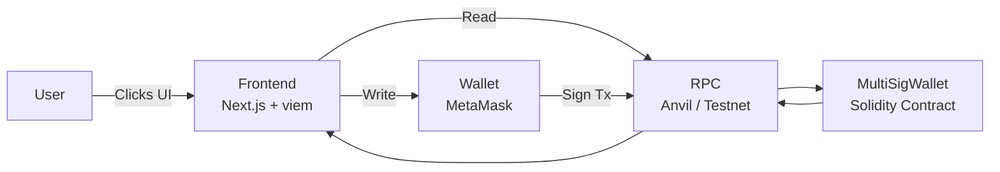
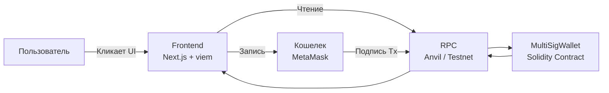

# MultiSig Wallet

A pragmatic multisig smart contract with Foundry tests plus a Next.js + viem frontend demo.

**Repository Overview**
This repository contains:
- `Contracts/` Solidity contract, scripts, and tests built with Foundry.
- `Frontend/` Demo UI for interacting with the contract using Next.js and viem.

**Architecture**


**Quick Start (Local)**
1. Start a local chain:
```bash
anvil --port 8545 --silent
```
2. Deploy the contract:
```bash
cd Contracts
forge install
forge create src/MultiSigWallet.sol:MultiSigWallet \
  --rpc-url http://127.0.0.1:8545 \
  --private-key <ANVIL_PRIVATE_KEY> \
  --constructor-args '["<OWNER1>","<OWNER2>","<OWNER3>"]' 2 \
  --broadcast
```
3. Configure the frontend environment:
Open `Frontend/.env.local` and set:
```
NEXT_PUBLIC_CONTRACT_ADDRESS=<DEPLOYED_ADDRESS>
NEXT_PUBLIC_CHAIN_ID=31337
NEXT_PUBLIC_RPC_URL=http://127.0.0.1:8545
```
4. Run the frontend:
```bash
cd Frontend
npm install
npm run dev
```
Open `http://localhost:3000` in your browser.

If `node -v` fails, install Node.js 18+ first (from the official Node.js site).

**Standard Deployment (Script + env vars)**
The recommended way to deploy is via the Foundry script with environment variables. This keeps owners and quorum in one place and avoids CLI parsing issues.

Set these variables:
- `PRIVATE_KEY` The deployer private key.
- `OWNERS` Comma‑separated owner addresses.
- `REQUIRED` Quorum, must be <= number of owners.

Git Bash example:
```bash
export PRIVATE_KEY=0xac0974...
export OWNERS=0xf39F...2266,0x7099...79C8,0x3C44...93BC
export REQUIRED=2

forge script script/MultiSigDeploy.s.sol:MultiSigDeploy \
  --rpc-url http://127.0.0.1:8545 \
  --broadcast
```

PowerShell example:
```powershell
$env:PRIVATE_KEY="0xac0974..."
$env:OWNERS="0xf39F...2266,0x7099...79C8,0x3C44...93BC"
$env:REQUIRED="2"

forge script script/MultiSigDeploy.s.sol:MultiSigDeploy `
  --rpc-url http://127.0.0.1:8545 `
  --broadcast
```

Tip: Use the first three Anvil accounts for local testing and set `REQUIRED=2` for a classic 2‑of‑3 multisig.

**Notes**
- Foundry is required for the `Contracts` project.
- Node.js 18+ is recommended for the frontend.
- The UI expects the owner addresses used during deployment.

**License**
MIT.

<details>
<summary>Русская версия</summary>

# MultiSig Wallet

Практичный мультисиг‑контракт с тестами на Foundry и демонстрационный фронтенд на Next.js + viem.

**Обзор репозитория**
В репозитории есть:
- `Contracts/` Контракт Solidity, скрипты и тесты на Foundry.
- `Frontend/` UI для работы с контрактом на Next.js и viem.

**Архитектура**


**Быстрый старт (локально)**
1. Запустите локальную сеть:
```bash
anvil --port 8545 --silent
```
2. Разверните контракт:
```bash
cd Contracts
forge install
forge create src/MultiSigWallet.sol:MultiSigWallet \
  --rpc-url http://127.0.0.1:8545 \
  --private-key <ANVIL_PRIVATE_KEY> \
  --constructor-args '["<OWNER1>","<OWNER2>","<OWNER3>"]' 2 \
  --broadcast
```
3. Настройте фронтенд:
Откройте `Frontend/.env.local` и задайте:
```
NEXT_PUBLIC_CONTRACT_ADDRESS=<DEPLOYED_ADDRESS>
NEXT_PUBLIC_CHAIN_ID=31337
NEXT_PUBLIC_RPC_URL=http://127.0.0.1:8545
```
4. Запустите фронтенд:
```bash
cd Frontend
npm install
npm run dev
```
Откройте `http://localhost:3000` в браузере.

Если `node -v` не работает, сначала установите Node.js 18+ (с официального сайта Node.js).

**Стандартный деплой (скрипт + переменные окружения)**
Рекомендуемый способ деплоя — через Foundry‑скрипт и переменные окружения. Так владельцы и кворум задаются явно и не ломаются из‑за кавычек в CLI.

Задайте переменные:
- `PRIVATE_KEY` Приватный ключ деплойера.
- `OWNERS` Адреса владельцев через запятую.
- `REQUIRED` Кворум, должен быть <= числу владельцев.

Пример для Git Bash:
```bash
export PRIVATE_KEY=0xac0974...
export OWNERS=0xf39F...2266,0x7099...79C8,0x3C44...93BC
export REQUIRED=2

forge script script/MultiSigDeploy.s.sol:MultiSigDeploy \
  --rpc-url http://127.0.0.1:8545 \
  --broadcast
```

Пример для PowerShell:
```powershell
$env:PRIVATE_KEY="0xac0974..."
$env:OWNERS="0xf39F...2266,0x7099...79C8,0x3C44...93BC"
$env:REQUIRED="2"

forge script script/MultiSigDeploy.s.sol:MultiSigDeploy `
  --rpc-url http://127.0.0.1:8545 `
  --broadcast
```

Совет: Для локального теста используйте первые три аккаунта Anvil и `REQUIRED=2` для схемы 2‑из‑3.

**Примечания**
- Для `Contracts` нужен Foundry.
- Для фронтенда рекомендуется Node.js 18+.
- UI ожидает адреса владельцев, указанные при деплое.

**Лицензия**
MIT.

</details>
