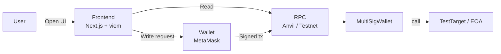
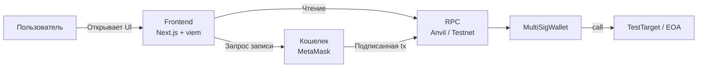

# MultiSig Wallet

Multisig smart contract project with:
- `Contracts/` Foundry contracts, tests, and deployment scripts.
- `Frontend/` Next.js + viem UI.
- `Scripts/` Git Bash helper scripts for local development.

**Architecture**


**What Is Implemented**
- `MultiSigWallet` with configurable owners and quorum.
- Auto-execution when confirmations reach quorum.
- `TestTarget` contract for validating multisig external calls.
- Deploy scripts based on environment variables in:
- `Contracts/script/MultiSigDeploy.s.sol`
- `Contracts/script/TestTargetDeploy.s.sol`
- Frontend features:
- RU/EN language switch + browser language auto-detect.
- Toast notifications on top with auto-hide.
- Wallet connect/reconnect flow.
- Chain mismatch check with local compatibility `1337 <-> 31337`.
- Transaction status badges: `Awaiting`, `Ready`, `Executed`.
- Auto-refresh for contract state.

**Project Docs**
- Contract details: `Contracts/README.md`
- Frontend details: `Frontend/README.md`
- Script usage: `Scripts/README.md`

**Quick Start (Local)**
1. Start local node:
```bash
bash Scripts/anvil.sh
```
2. Prepare env file for scripts:
```bash
cp Scripts/.env.example Scripts/.env
```
3. Deploy multisig:
```bash
bash Scripts/deploy-multisig.sh
```
4. Deploy TestTarget (owner = multisig):
```bash
bash Scripts/deploy-testtarget.sh
```
5. Configure frontend env in `Frontend/.env.local`:
```dotenv
NEXT_PUBLIC_CONTRACT_ADDRESS=<MULTISIG_ADDRESS>
NEXT_PUBLIC_CHAIN_ID=31337
NEXT_PUBLIC_RPC_URL=http://127.0.0.1:8545
```
6. Run frontend:
```bash
cd Frontend
npm install
npm run dev
```
Open `http://localhost:3000`.

**Requirements**
- Foundry (`forge`, `anvil`, `cast`)
- Node.js `18+`
- MetaMask (or compatible injected wallet)

**License**
MIT

<details>
<summary>Русская версия</summary>

# MultiSig Wallet

Проект мультисиг-кошелька с тремя уровнями:
- `Contracts/` контракты, тесты и скрипты деплоя на Foundry.
- `Frontend/` UI на Next.js + viem.
- `Scripts/` вспомогательные Git Bash-скрипты для локальной работы.

**Архитектура**


**Что уже реализовано**
- `MultiSigWallet` с настраиваемыми владельцами и кворумом.
- Автоисполнение транзакции при достижении кворума.
- Контракт `TestTarget` для проверки внешних вызовов через мультисиг.
- Скриптовый деплой через переменные окружения в:
- `Contracts/script/MultiSigDeploy.s.sol`
- `Contracts/script/TestTargetDeploy.s.sol`
- Во фронтенде:
- Переключение языка RU/EN + автоопределение языка браузера.
- Всплывающие верхние уведомления (toast) с автоскрытием.
- Сценарий подключения/переподключения кошелька.
- Проверка chain id, включая совместимость локальных `1337 <-> 31337`.
- Статусы транзакций: `Ожидает`, `Готова`, `Исполнена`.
- Автообновление состояния контракта.

**Документация по уровням**
- Детали контрактов: `Contracts/README.md`
- Детали фронтенда: `Frontend/README.md`
- Использование скриптов: `Scripts/README.md`

**Быстрый локальный запуск**
1. Запустить локальную сеть:
```bash
bash Scripts/anvil.sh
```
2. Подготовить env для скриптов:
```bash
cp Scripts/.env.example Scripts/.env
```
3. Развернуть мультисиг:
```bash
bash Scripts/deploy-multisig.sh
```
4. Развернуть TestTarget (владелец = адрес мультисига):
```bash
bash Scripts/deploy-testtarget.sh
```
5. Настроить фронтенд в `Frontend/.env.local`:
```dotenv
NEXT_PUBLIC_CONTRACT_ADDRESS=<MULTISIG_ADDRESS>
NEXT_PUBLIC_CHAIN_ID=31337
NEXT_PUBLIC_RPC_URL=http://127.0.0.1:8545
```
6. Запустить фронтенд:
```bash
cd Frontend
npm install
npm run dev
```
Открыть `http://localhost:3000`.

**Требования**
- Foundry (`forge`, `anvil`, `cast`)
- Node.js `18+`
- MetaMask (или совместимый кошелек)

**Лицензия**
MIT

</details>
